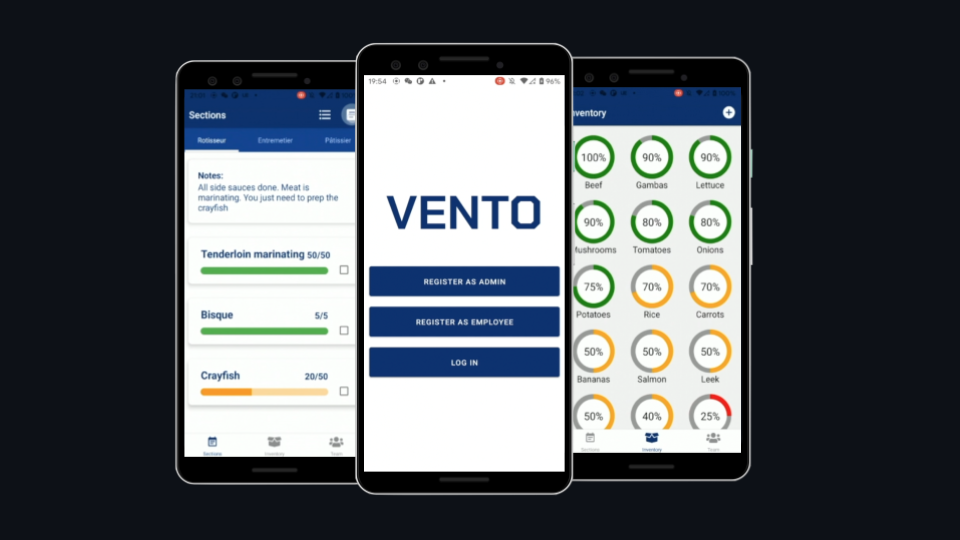

# Vento

## Server Repo

> This is the server side, for the [client](https://github.com/geroalexander/vento_client) side, navigate to another repository.

Vento is a lightweight application built for small and medium sized restaurant kitchens, that combines an inventory management system with a task organiser.

1. Communications within the kitchen team, making handovers during shift change and shift end _fluid and reliable_.
2. Improving the efficency of each individual kitchen section by _providing an overview_ of the required tasks to be completed.
3. Contributing to higher job satisfaction by adressing the serious lack of IT solutions for _back of house_ hospitality operations.

## Getting Started

> Feel free to checkout my code or run the app on your own machine. Follow the instructions below to get a local development instance of Vento set up.
> _You must have expo installed for this to work_.

1. Clone this repo:

`git clone https://github.com/geroalexander/vento_server.git`

2. Install all dependencies:

` npm install`

3. Launch the server:

`node src/index.js`

4. Launch the client:

See [client](https://github.com/geroalexander/vento_client.git) repo

5. View the app:

The easiest way to do this is by scanning the QR code shown once you run the client. Alternatively you can use XCode with iOS or Android Emulator with Android.

## Tech Stack

### Frontend

- [React Native](https://reactnative.dev/)
- [Expo](https://expo.io/)

### Backend

- [Node.js](https://nodejs.org/en/)
- [Express](https://expressjs.com/)
- [MongoDB](https://www.mongodb.com/)
- [Mongoose](https://mongoosejs.com/)

## Next steps

In the future I would like to modify this application to work as a PWA and make is accessibile for both native and web/desktop use.

## Contributors
#### Gero Kassing
- [LinkedIn](https://www.linkedin.com/in/gero-kassing-9b79311a3/)
- [GitHub](https://github.com/geroalexander)
